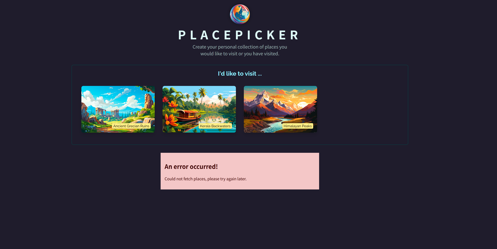

# React Data Fetching 학습 프로젝트

이 프로젝트는 React에서 HTTP 요청 전송과 백엔드 서버와의 데이터 통신에 대해 학습한 프로젝트입니다.

## 📸 프로젝트 스크린샷




## 🎯 프로젝트 개요

PlacePicker는 사용자가 방문하고 싶은 장소나 이미 방문한 장소들을 개인적으로 수집할 수 있는 React 애플리케이션입니다. 이 프로젝트를 통해 다음과 같은 내용들을 학습했습니다:

- React에서 HTTP 요청 전송하기
- 백엔드 서버와의 데이터 통신
- 비동기 데이터 처리 및 상태 관리
- 에러 핸들링
- 로딩 상태 관리

## 🏗️ 프로젝트 구조

```
react-data-fetching/
├── src/                    # React 프론트엔드
│   ├── components/         # React 컴포넌트들
│   ├── http.js            # HTTP 요청 함수들
│   └── App.jsx            # 메인 앱 컴포넌트
├── backend/               # Node.js 백엔드 서버
│   ├── app.js            # Express 서버
│   └── data/             # JSON 데이터 파일들
└── public/               # 정적 파일들
```

## 🔧 기술 스택

### 프론트엔드

- **React 19.1.0**: 컴포넌트 기반 UI 라이브러리
- **Vite**: 빠른 빌드 도구
- **JavaScript (ES6+)**: 모던 자바스크립트

### 백엔드

- **Node.js**: JavaScript 런타임
- **Express.js 5.1.0**: 웹 서버 프레임워크
- **body-parser**: HTTP 요청 본문 파싱

## 📚 주요 학습 내용

### 1. HTTP 요청 전송 (`src/http.js`)

```javascript
// 사용 가능한 장소 목록 가져오기
export async function fetchAvailablePlaces() {
  const response = await fetch("http://localhost:3000/places");
  const resData = await response.json();

  if (!response.ok) {
    throw new Error("Failed to fetch places");
  }

  return resData.places;
}

// 사용자 장소 목록 가져오기
export async function fetchUserPlaces() {
  const response = await fetch("http://localhost:3000/user-places");
  const resData = await response.json();

  if (!response.ok) {
    throw new Error("Failed to fetch user places");
  }

  return resData.places;
}

// 사용자 장소 목록 업데이트
export async function updateUserPlaces(places) {
  const response = await fetch("http://localhost:3000/user-places", {
    method: "PUT",
    body: JSON.stringify({ places }),
    headers: {
      "Content-Type": "application/json",
    },
  });

  const resData = await response.json();

  if (!response.ok) {
    throw new Error("Failed to update user data.");
  }

  return resData.message;
}
```

### 2. React에서 데이터 페칭

#### `useEffect`를 사용한 데이터 로딩

```javascript
useEffect(() => {
  async function fetchPlaces() {
    setIsFetching(true);
    try {
      const userPlaces = await fetchUserPlaces();
      setUserPlaces(userPlaces);
    } catch (error) {
      setError({ message: error.message || "Failed to fetch user places." });
    }
    setIsFetching(false);
  }

  fetchPlaces();
}, []);
```

#### 낙관적 업데이트 (Optimistic Updates)

```javascript
async function handleSelectPlace(selectedPlace) {
  // UI 먼저 업데이트 (낙관적 업데이트)
  setUserPlaces((prevPickedPlaces) => {
    if (!prevPickedPlaces) {
      prevPickedPlaces = [];
    }
    if (prevPickedPlaces.some((place) => place.id === selectedPlace.id)) {
      return prevPickedPlaces;
    }
    return [selectedPlace, ...prevPickedPlaces];
  });

  try {
    // 서버에 데이터 전송
    await updateUserPlaces([selectedPlace, ...userPlaces]);
  } catch (error) {
    // 실패 시 이전 상태로 롤백
    setUserPlaces(userPlaces);
    setErrorUpdatingPlaces({
      message: error.message || "Failed to update places",
    });
  }
}
```

### 3. 백엔드 API 서버 (`backend/app.js`)

#### CORS 설정

```javascript
app.use((req, res, next) => {
  res.setHeader("Access-Control-Allow-Origin", "*");
  res.setHeader("Access-Control-Allow-Methods", "GET, PUT");
  res.setHeader("Access-Control-Allow-Headers", "Content-Type");
  next();
});
```

#### RESTful API 엔드포인트

```javascript
// GET /places - 모든 장소 목록 조회
app.get("/places", async (req, res) => {
  const fileContent = await fs.readFile("./data/places.json");
  const placesData = JSON.parse(fileContent);
  res.status(200).json({ places: placesData });
});

// GET /user-places - 사용자 장소 목록 조회
app.get("/user-places", async (req, res) => {
  const fileContent = await fs.readFile("./data/user-places.json");
  const places = JSON.parse(fileContent);
  res.status(200).json({ places });
});

// PUT /user-places - 사용자 장소 목록 업데이트
app.put("/user-places", async (req, res) => {
  const places = req.body.places;
  await fs.writeFile("./data/user-places.json", JSON.stringify(places));
  res.status(200).json({ message: "User places updated!" });
});
```

### 4. 상태 관리 및 에러 핸들링

#### 로딩 상태 관리

```javascript
const [isFetching, setIsFetching] = useState(false);
const [error, setError] = useState();

// 로딩 표시
{
  isLoading && <p className="fallback-text">{loadingText}</p>;
}

// 에러 표시
{
  error && <ErrorPage title="An error occurred!" message={error.message} />;
}
```

#### 에러 바운더리와 모달을 통한 에러 표시

```javascript
<Modal open={errorUpdatingPlaces} onClose={handleError}>
  {errorUpdatingPlaces && (
    <ErrorPage
      title={"An error occurred!"}
      message={errorUpdatingPlaces.message}
      onConfirm={handleError}
    />
  )}
</Modal>
```

### 5. 지리적 위치 기반 정렬

```javascript
// 사용자의 현재 위치를 기반으로 장소들을 거리순으로 정렬
navigator.geolocation.getCurrentPosition((position) => {
  const sortedPlaces = sortPlacesByDistance(
    places,
    position.coords.latitude,
    position.coords.longitude
  );
  setAvailablePlaces(sortedPlaces);
});
```

## 🚀 실행 방법

### 백엔드 서버 실행

```bash
cd backend
npm install
node app.js
```

### 프론트엔드 실행

```bash
npm install
npm run dev
```

서버가 실행되면 다음 주소에서 확인할 수 있습니다:

- 프론트엔드: http://localhost:5173
- 백엔드 API: http://localhost:3000

## 🎓 학습 성과

이 프로젝트를 통해 다음과 같은 개념들을 실습하고 학습했습니다:

1. **HTTP 통신**: fetch API를 사용한 GET, PUT 요청
2. **비동기 처리**: async/await를 활용한 비동기 데이터 처리
3. **상태 관리**: React hooks를 사용한 복잡한 상태 관리
4. **에러 핸들링**: try-catch를 통한 에러 처리 및 사용자 피드백
5. **낙관적 업데이트**: 사용자 경험 향상을 위한 UI 업데이트 전략
6. **RESTful API**: Express.js를 사용한 REST API 설계 및 구현
7. **CORS**: 크로스 오리진 리소스 공유 설정
8. **파일 시스템**: Node.js fs 모듈을 사용한 파일 읽기/쓰기
9. **지리적 위치**: Geolocation API 활용

## 📝 주요 특징

- **실시간 데이터 동기화**: 프론트엔드와 백엔드 간 실시간 데이터 동기화
- **에러 복구**: 네트워크 오류 시 이전 상태로 자동 롤백
- **로딩 상태**: 사용자에게 명확한 로딩 피드백 제공
- **지리적 정렬**: 사용자 위치 기반 장소 정렬
- **반응형 UI**: 다양한 상태에 따른 적절한 UI 표시
